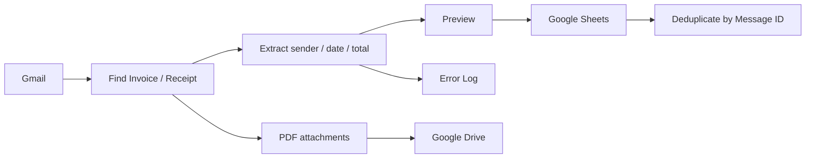

# Gmail Invoice Automation Demo

A small Google Apps Script portfolio project that automates a practical Google Workspace workflow:

**Gmail → extract invoice/receipt data → Google Sheets → save PDF attachments to Google Drive**

## What it demonstrates

- Google Apps Script
- Gmail / Google Sheets / Google Drive automation
- workflow analysis and implementation
- duplicate prevention using Gmail message IDs
- preview / dry-run before production writes
- error logging
- maintainable configuration using Script Properties
- handoff-oriented setup documentation

## Workflow

## Functional demo result

Tested with synthetic data.

- setup sheets: PASS
- Gmail matching: PASS
- preview: PASS
- Google Sheets record write: PASS
- PDF attachment save to Drive: PASS
- processed Gmail label: PASS
- duplicate-safe re-run: PASS

## Security / privacy

- No API keys, spreadsheet IDs, folder IDs, private emails, or client data are stored in this repository.
- `SHEET_ID` and `FOLDER_ID` are configured as Apps Script Script Properties.
- Use synthetic data when testing the public demo.
- Do not upload real company invoices or customer data to a public portfolio repository.

## Setup

See [SETUP.md](SETUP.md).

## Honest scope

This is a portfolio demo, not a claim of production-scale accounting or invoice-processing expertise.

The goal is to demonstrate the ability to turn a bounded business workflow into a working, auditable Google Workspace automation.

## Natural extensions

Only add these when a real project requires them:

- AI extraction for inconsistent email/PDF formats
- OCR
- approval/review queues
- Slack / Google Chat notifications
- API / webhook integrations
- scheduled execution and alerts
