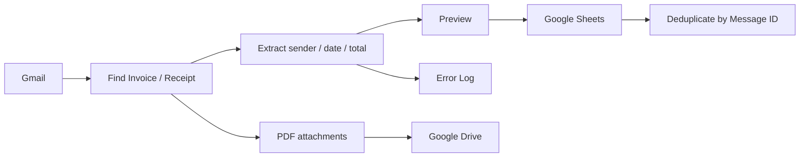

# Gmail Invoice Automation Demo

A working Google Apps Script portfolio project for a common small-business workflow:

**Gmail → identify invoice/receipt emails → preview extracted data → Google Sheets → save PDF attachments to Google Drive**

## Business problem

Invoice and receipt intake often involves repetitive manual work: finding relevant emails, copying basic fields into a spreadsheet, saving attachments, and avoiding duplicate entries.

This demo turns that bounded workflow into an auditable automation. It can:

- find recent invoice / receipt emails
- extract sender, date, subject, and a best-effort total
- preview matches before production writes
- record structured results in Google Sheets
- save PDF attachments to Google Drive
- prevent duplicate processing using Gmail message IDs
- label processed threads
- record failures in a dedicated error sheet

**Portfolio signal:** this project demonstrates taking a real Google Workspace workflow from manual steps to a working, configurable, handoff-ready automation rather than only writing an isolated script.

## What it demonstrates

- Google Apps Script
- Gmail / Google Sheets / Google Drive automation
- workflow analysis and implementation
- duplicate prevention using Gmail message IDs
- preview / dry-run before production writes
- error logging
- maintainable configuration using Script Properties
- handoff-oriented setup documentation

## Workflow

## Functional demo result

Tested with synthetic data.

- setup sheets: PASS
- Gmail matching: PASS
- preview: PASS
- Google Sheets record write: PASS
- PDF attachment save to Drive: PASS
- processed Gmail label: PASS
- duplicate-safe re-run: PASS

See [DEMO_RESULTS.md](DEMO_RESULTS.md) for the recorded bounded test result.

## Example client fit

The same implementation pattern can be adapted to bounded Google Workspace workflows such as:

- invoice / receipt intake
- email-to-spreadsheet data capture
- attachment collection and filing
- lightweight operational logs
- repetitive Gmail / Sheets / Drive workflows

The exact extraction rules and workflow should be adapted to the client's real inputs and review requirements.

## Security / privacy

- No API keys, spreadsheet IDs, folder IDs, private emails, or client data are stored in this repository.
- `SHEET_ID` and `FOLDER_ID` are configured as Apps Script Script Properties.
- Use synthetic data when testing the public demo.
- Do not upload real company invoices or customer data to a public portfolio repository.

## Setup

See [SETUP.md](SETUP.md).

## Honest scope

This is a portfolio demo, not a claim of production-scale accounting or invoice-processing expertise.

The goal is to demonstrate the ability to turn a bounded business workflow into a working, auditable Google Workspace automation.

## Natural extensions

Only add these when a real project requires them:

- AI extraction for inconsistent email/PDF formats
- OCR
- approval/review queues
- Slack / Google Chat notifications
- API / webhook integrations
- scheduled execution and alerts
